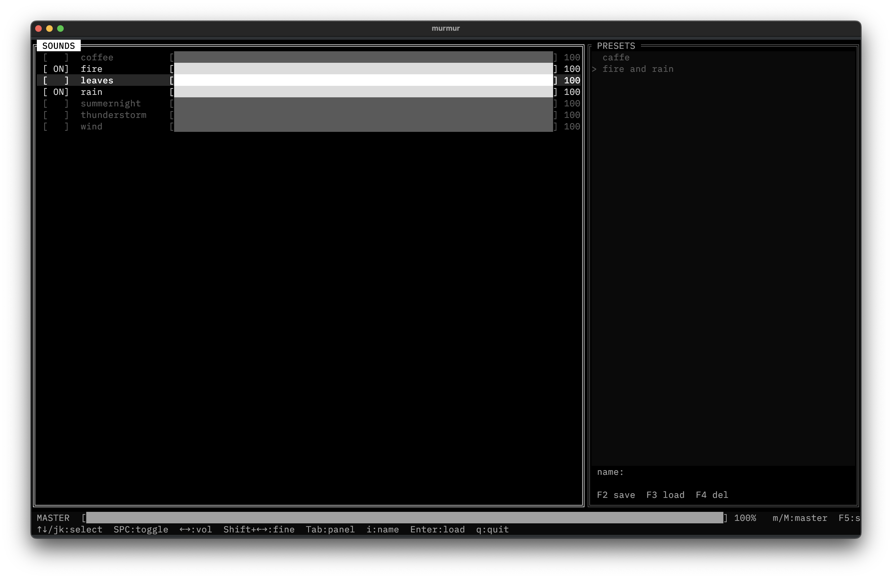

# murmur



Ambient sound mixer for the terminal. Play multiple looping OGG files simultaneously with individual and master volume control. Save and load named presets.

## Install

```
make install
```

This will:
- Build the release binary with `cargo build --release`
- Install it to `~/.cargo/bin/murmur`
- Create `~/.config/murmur/sounds/` and copy the bundled sound files there (existing files are left untouched)

To remove the binary:

```
make uninstall
```

This removes the binary but leaves `~/.config/murmur/` intact so presets are preserved.

## Usage

```
murmur
```

On first launch, no sounds play. Toggle sounds with `Space`, adjust volumes with `←`/`→`, and save the mix as a named preset with `F2`. The last loaded preset is restored automatically on the next launch.

## Keys

| Key | Action |
|-----|--------|
| `↑` `↓` / `j` `k` | Move cursor |
| `Space` | Toggle sound on/off |
| `←` `→` | Volume ±5% |
| `Shift+←` `Shift+→` | Volume ±1% |
| `m` / `M` | Master volume ±5% |
| `Tab` | Switch panel (Sounds ↔ Presets) |
| `i` | Enter preset name |
| `Enter` | Load selected preset |
| `Esc` | Cancel input |
| `F2` | Save preset |
| `F3` | Load preset |
| `F4` | Delete preset |
| `F5` | Stop all |
| `q` / `Ctrl+C` | Quit |

## Presets

Presets are stored in `~/.config/murmur/presets.json`.

## Dependencies

- [ratatui](https://github.com/ratatui-org/ratatui) — TUI
- [rodio](https://github.com/RustAudio/rodio) — audio playback
- [crossterm](https://github.com/crossterm-rs/crossterm) — terminal input
